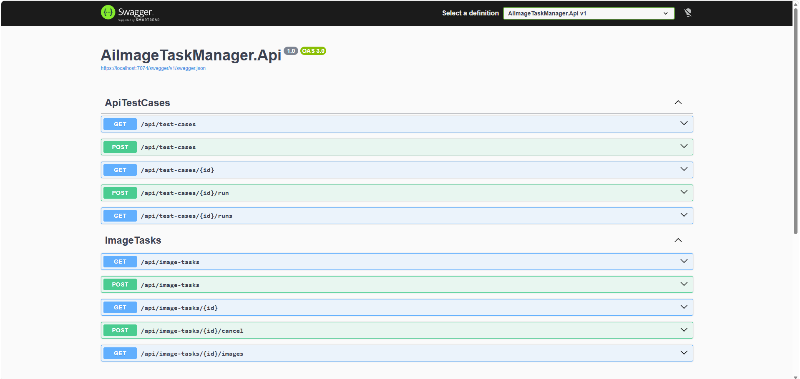
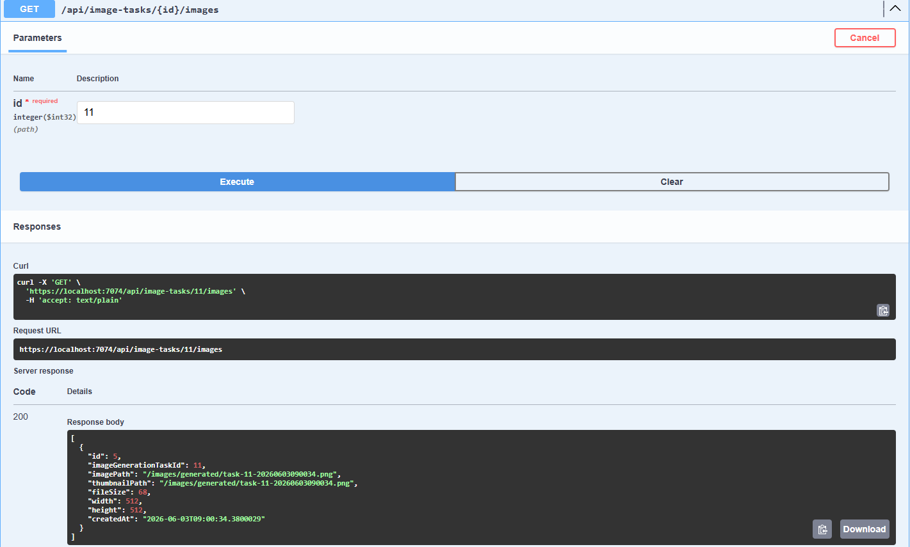

# AiImageTaskManager


AI image generation task management and API test automation backend system built with ASP.NET Core Web API.

This project simulates an AI image generation workflow. Users can create image generation tasks, track task status, process tasks asynchronously through a background service, store generated image records, and manage API test cases with execution history.

> Current version uses a mock PNG output to simulate image generation. Stable Diffusion WebUI / ComfyUI integration is planned as a future enhancement.

---

## Features

### Image Task Management

* Create image generation tasks
* Query all image tasks
* Query a single image task
* Cancel image tasks
* Track task status

Task status flow:

```text
Pending → Running → Completed
```

Supported task statuses:

```text
Pending
Running
Completed
Failed
Cancelled
```

### Background Processing

The project uses ASP.NET Core `BackgroundService` to simulate asynchronous image generation.

When a task is created, the system stores it as `Pending`.
The background service then picks up pending tasks, changes the status to `Running`, simulates processing, stores a generated image record, and marks the task as `Completed`.

### Generated Image Storage

After a task is completed, the system stores a generated image file under:

```text
wwwroot/images/generated
```

The generated image metadata is also stored in the database, including:

* Image path
* Thumbnail path
* File size
* Width
* Height
* Created time

The image can be accessed through a static file URL, for example:

```text
/images/generated/task-11-20260603090034.png
```

### API Test Case Module

The project includes a simple API test automation module.

It supports:

* Create API test cases
* Query API test cases
* Execute HTTP requests
* Validate expected HTTP status code
* Store test execution results
* Query test run history

---

## Screenshots

### Swagger API Overview



### Generated Image Result

After an image task is completed, the system stores a generated image file and returns the generated image path through the API.



---

## Tech Stack

* C#
* ASP.NET Core Web API
* Entity Framework Core
* SQLite
* BackgroundService
* Swagger / OpenAPI
* xUnit
* WebApplicationFactory
* GitHub Actions CI
* Local file storage

---

## Project Structure

```text
AiImageTaskManager
├── AiImageTaskManager.Api
│   ├── Controllers
│   ├── Program.cs
│   └── wwwroot/images/generated
│
├── AiImageTaskManager.Application
│   ├── DTOs
│   └── Interfaces
│
├── AiImageTaskManager.Domain
│   ├── Entities
│   └── Enums
│
├── AiImageTaskManager.Infrastructure
│   ├── BackgroundJobs
│   ├── Data
│   ├── FileStorage
│   └── Services
│
└── AiImageTaskManager.IntegrationTests
    ├── ApiTestCases
    ├── Factories
    └── ImageTasks
```

---

## API Endpoints

### Image Tasks

```http
GET    /api/image-tasks
POST   /api/image-tasks
GET    /api/image-tasks/{id}
POST   /api/image-tasks/{id}/cancel
GET    /api/image-tasks/{id}/images
```

### API Test Cases

```http
GET    /api/test-cases
POST   /api/test-cases
GET    /api/test-cases/{id}
POST   /api/test-cases/{id}/run
GET    /api/test-cases/{id}/runs
```

---

## Example Requests

### Create Image Task

```http
POST /api/image-tasks
```

```json
{
  "prompt": "a realistic train running on railway tracks",
  "negativePrompt": "blurry, low quality",
  "width": 512,
  "height": 512,
  "steps": 20,
  "cfgScale": 7,
  "seed": 12345
}
```

### Get Generated Images

```http
GET /api/image-tasks/{id}/images
```

Example response:

```json
[
  {
    "id": 5,
    "imageGenerationTaskId": 11,
    "imagePath": "/images/generated/task-11-20260603090034.png",
    "thumbnailPath": "/images/generated/task-11-20260603090034.png",
    "fileSize": 68,
    "width": 512,
    "height": 512,
    "createdAt": "2026-06-03T09:00:34.3800029"
  }
]
```

### Create API Test Case

```http
POST /api/test-cases
```

```json
{
  "name": "Get all image tasks",
  "method": "GET",
  "url": "https://localhost:7074/api/image-tasks",
  "headersJson": null,
  "bodyJson": null,
  "expectedStatusCode": 200
}
```

---

## Integration Tests

This project uses xUnit and `WebApplicationFactory` for integration testing.

The test environment uses `InMemoryDatabase` to avoid affecting the local SQLite development database.

Current integration tests cover:

* Create image task
* Get image task list
* Get image task by ID
* Get non-existing image task
* Create API test case
* Get API test case list
* Get API test case by ID
* Get non-existing API test case

Run tests:

```bash
dotnet test
```

---

## CI/CD

This project uses GitHub Actions for continuous integration.

The workflow runs automatically on every push or pull request to `main` and executes:

```bash
dotnet restore
dotnet build
dotnet test
```

---

## Getting Started

### Prerequisites

* .NET SDK
* Git
* Visual Studio 2026 or later
* SQLite-compatible EF Core provider

### 1. Clone the repository

```bash
git clone https://github.com/t0037798/AiImageTaskManager.git
cd AiImageTaskManager
```

### 2. Restore packages

```bash
dotnet restore AiImageTaskManager.slnx
```

### 3. Apply database migration

```bash
dotnet ef database update --project AiImageTaskManager.Infrastructure --startup-project AiImageTaskManager.Api
```

### 4. Run the API

```bash
dotnet run --project AiImageTaskManager.Api
```

After the API starts, open Swagger:

```text
https://localhost:7074/swagger
```

---

## Key Highlights

* Layered architecture separating API, Application, Domain, and Infrastructure
* EF Core migration-based database management
* BackgroundService-based asynchronous task processing
* Generated image metadata and local static file storage
* API test case management and execution history
* xUnit integration tests with isolated test database
* GitHub Actions CI for automated build and test

---

## Current Limitations

* Image generation currently uses a mock PNG file instead of a real AI generation model.
* Stable Diffusion WebUI / ComfyUI integration is not implemented yet.
* Authentication and user-based task ownership are not implemented yet.
* API test cases currently validate HTTP status code only.
* Frontend dashboard is not implemented yet.

---

## Future Work

* Integrate Stable Diffusion WebUI API or ComfyUI API
* Add JWT authentication and user-based task ownership
* Add frontend dashboard
* Support response body validation for API test cases
* Support multi-step API test workflows
* Replace SQLite with PostgreSQL or SQL Server
* Add Docker Compose deployment environment
